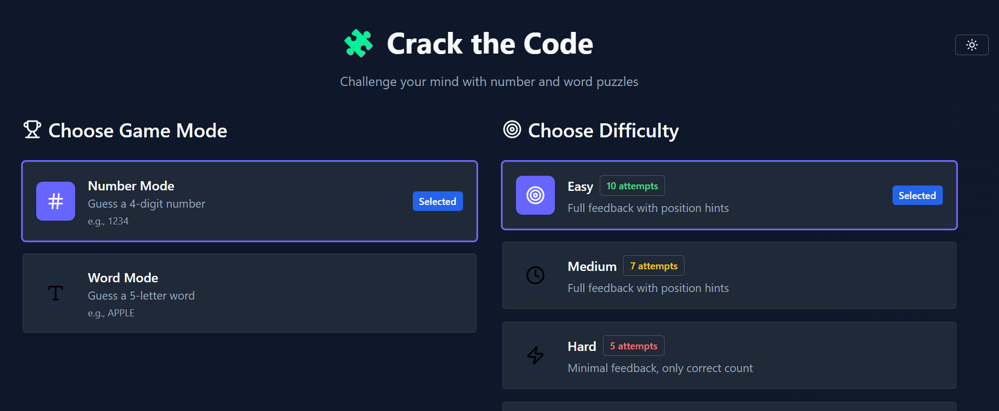

## 🧩 Crack the Code – A Mind-Bending Puzzle Game

**Live Demo:** [https://crack-the-code-nine.vercel.app](https://crack-the-code-nine.vercel.app)

Crack the Code is a logic-based puzzle game where players must guess a hidden number or word. Create your own custom games, challenge friends, and train your brain!

---

### 🚀 Features

* 🔢 Number or 📝 Word guessing modes
* 🧠 Challenge friends with custom puzzles
* ♾️ Support for unlimited attempts or capped attempts
* 💡 Light/Dark theme toggle with persistence
* 🛠️ Built with React, Tailwind CSS, and React Router

---

### 📸 Screenshots



---

### 🧰 Tech Stack

* **React** – Functional components and hooks
* **Tailwind CSS** – For styling
* **React Router v6** – Routing
* **Context API** – For theme and game state
* **Vite / Create React App**
* **Vercel** – Deployment

---

### 📁 Project Structure

```
/public
  ├── index.html
  ├── logo.svg
  └── manifest.json

/src
  ├── App.jsx
  ├── index.js
  ├── index.css
  ├── /components
  ├── /pages
  └── /utils
```

---

### 🧪 Available Routes

| Path             | Description                  |
| ---------------- | ---------------------------- |
| `/`              | Home page                    |
| `/number`        | Number guessing game         |
| `/word`          | Word guessing game           |
| `/create`        | Create custom game           |
| `/play?code=...` | Auto-redirect to custom game |
| `*`              | 404 Not Found                |

---

### 📦 Installation

```bash
git clone https://github.com/Cozyamy/Crack_the_Code.git
cd crack-the-code
npm install
npm start
```

---

### 🧩 Custom Game Sharing

Custom game URLs are generated with encrypted parameters:

```txt
/play?code=<encrypted_game_config>
```

Game config includes:

* `mode`: `number` or `word`
* `answer`: the correct answer
* `maxAttempts`: number of allowed guesses (`Infinity` for unlimited)

---

### 🌗 Theme Support

* Theme is persisted using `localStorage`
* Controlled via `ThemeProvider` context

---

### 📱 PWA Support

* Includes a `manifest.json` for installability